## Uvod

V tem projektu smo analizirali podatke o premitnih nesrečah v Sloveniji z uporabo različnih statističnih metod in vizualizacij. Osredotočili smo se na iskanje vplivnih dejavnikov nesreč in resnost prometnih nesreč ter pripravili interaktivno aplikacijo s pomočjo streamlit, ki omogoča vpogled v podatke in iporabo napovednega modela za oceno tveganja.

## Zajemanje podatkov

Podatke bomo črpali iz odprte baze [prometnih nesreč v Sloveniji od leta 2009 dalje](https://podatki.gov.si/dataset/mnzpprometne-nesrece-od-leta-2009-dalje), ki je na voljo na portalu [podatki.gov.si](https://podatki.gov.si/). Podatki vsebujejo informacije o času in lokaciji nesreč, vzrokih, vremenskih razmerah, stanju cest, udeležencih ter drugih dejavnikih. Oblika podatkov je strukturirana tabela s podrobnostmi o vsaki nesreči.

Občine slovenije in njihove lokacije smo prodobili preko na spletni strani  [simplemaps](https://simplemaps.com/gis/country/si#admin1). Za branje pa smo uporabili knjižnico `geopandas`.

## Vizualizacije

za branje podatkov v Pythonu smo uporabili `pandas` knjižnico, grafe pa smo risali z `matplotlib`, `seaborn` ter`plotly`. Napovedne modele smo implementirali z uporabo `scikit-learn`.

## Vpliv alkohola na prometne nesreče

Za začetek smo si pogledali pogosto največjega krivca za prometne nesreče - alkohol. 

  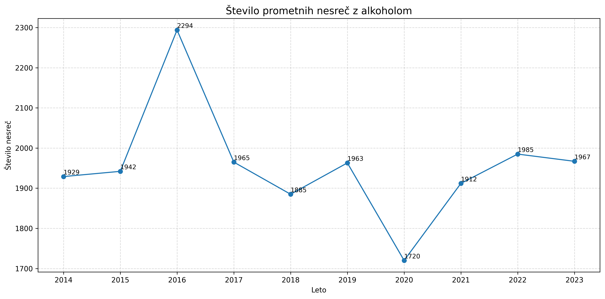
  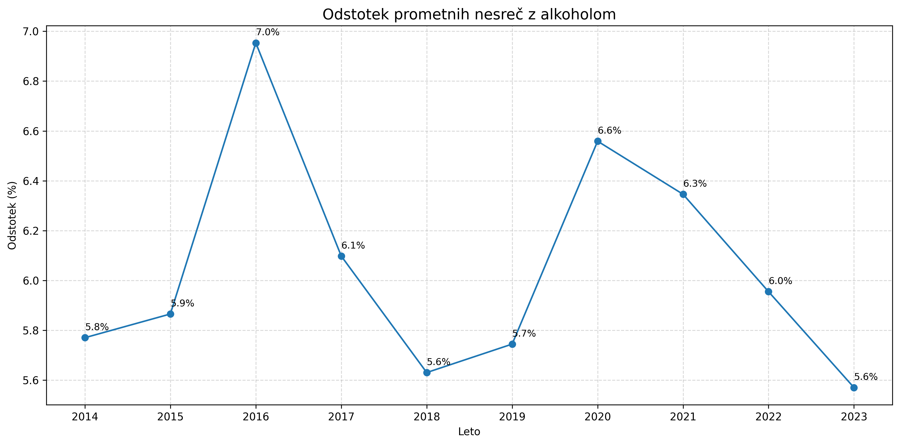

Iz grafa je razvidno, da se vrednosti v preteklih letih niso bistveno spreminjale, vendar sta izstopali dve leti – 2016 in 2020. Leto 2020  je še posebej zanimivo, saj kljub precejšnjemu zmanjšanju prometnih nesreč zaradi karantene, skoraj največ nesreč s prisotnim alkoholom prav v tem letu.

Naslednja stvar, ki smo si pogledali, je prisotnost alkohola v krvi v mg/L. Upoštevali smo le tiste primere, v katerih je bil alkohol dejansko prisoten v krvi.

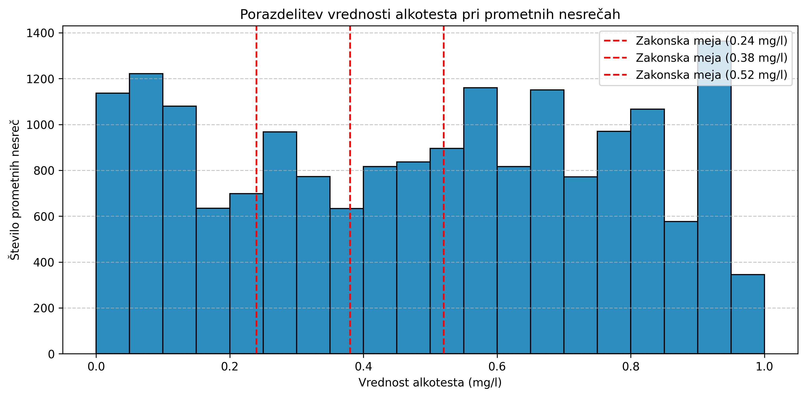

Na grafu so 3 zakonske meje, kjer ima vsaka meja svojo kazen.

Opazimo, da je najvišja in najbol konsistentna višina pri vrednosti do prvi meji (do 0.24 mg/L), saj si največ ljudi upa še voziti, ko spijejo malo, saj vejo, da ne bodo dobili nobene kazni.
Opazimo tudi, da je največjo število nesreč (~ 75%) nad dovoljeno mejo. 

Za prometne nesreče z alkotestom smo si pogledali še, koliko promila so imeli v sebi ob določeni uri, ko je bila nesreča.

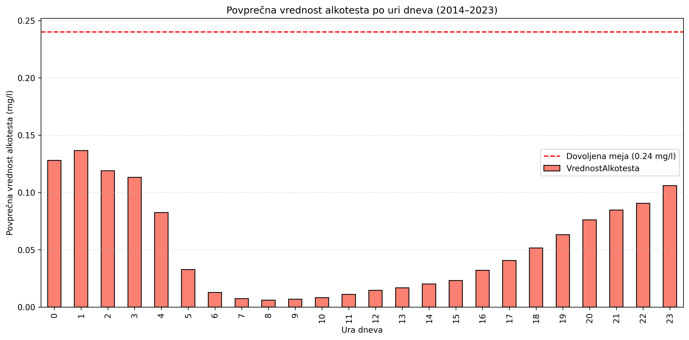

Porazdelitev spominja na obrnjeno zvonasto krivuljo - višje vrednosti promilov so zabeležene zgodaj zjutraj in pozno zvečer, kar je verjetno povezano s tem, da se ljudje v teh urah vračajo z družavnih dogodkov.

Če iz analize izključimo primere z 0.0 promila ali manjkajočo vrednostjo, dobimo nekoliko drugačno sliko. Porazdelitev je še vedno podobna, a manj izrazito zvonasto in rahlo bolj enakomerna.

## Število nesreč glede na uro

Ravnokar smo si pogledali, kdaj se največkrat zgodijo prometne nesreče, ko je prisoten alkohol, sedaj pa si bomo pogledali še število vseh prometnih nesreč glede na uro v dnevu.

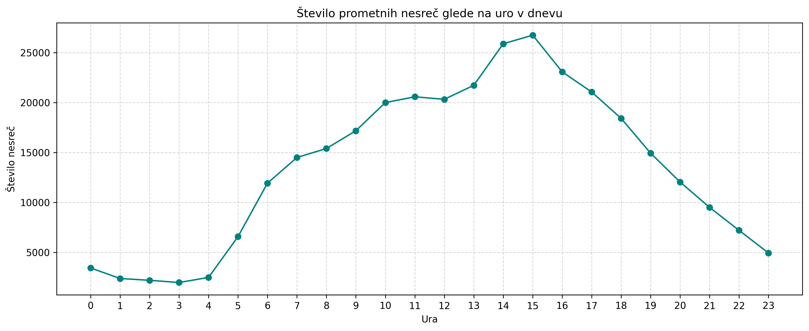

Opazimo, da je tukaj ravno obratno kot pri zgornjem grafu - tukaj nekako sledijo normalni porazdelitvi. Največ nesreč se zgodi sredi dneva, najmanj pa ob poznih in zgodnjah urah.

Prav tako smo ugotovili, da je ura glavni faktor, preko katerega lahko napovemo resnost prometne nesreče.

## Zemljevid nesreč

Prvo smo si pogledali, kako so prometne nesreče porazdeljene po občinah.

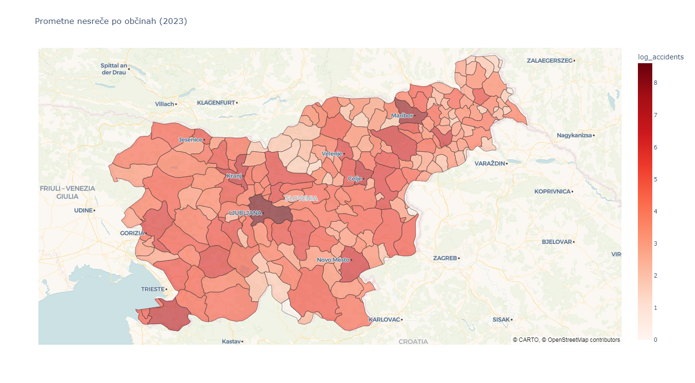

Prometne nesreče se najpogosteje v pogosteje naseljenih občinah (Ljubljana, Maribor ...)

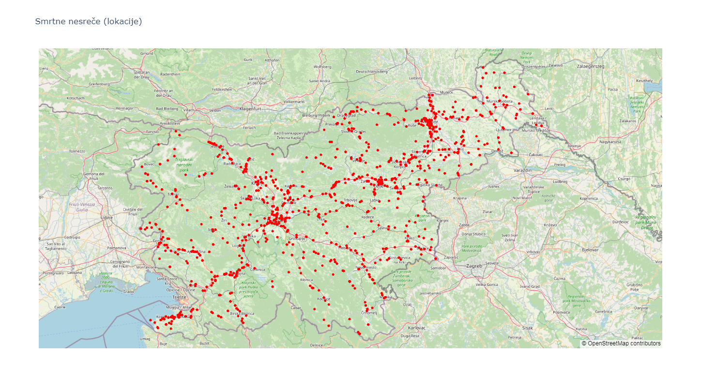

Zraven smo naredili še zemljevid, ki prikazuje smrtne nesreče in opazili, da je največ prometnih nesreč na avtocesti, veliko pa tudi v Ljubljani in Mariboru, saj se tam zgodi največ prometnih nesreč.

## Število prometnih nesreč po letih glede na klasifikacijo

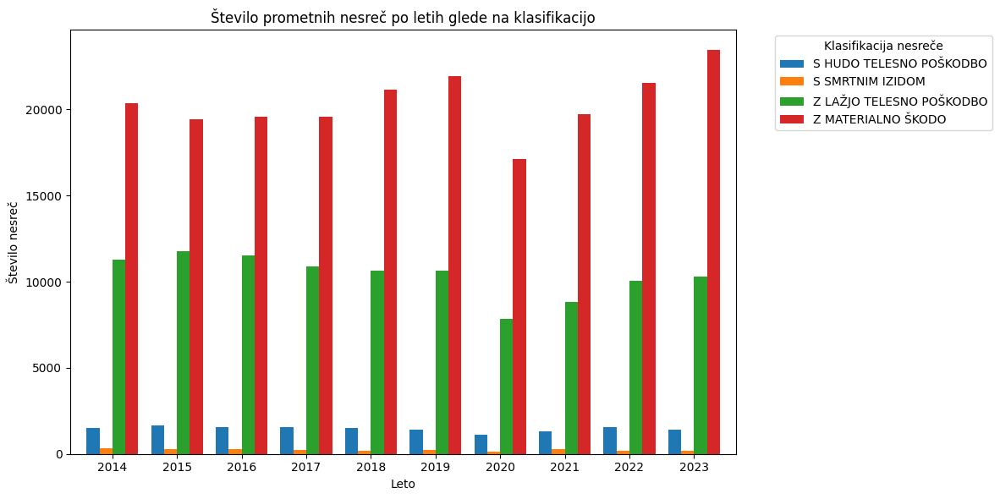

Kot pričakovano, je zdaleč največ prometnih nesreč z materialno škodo, nepričakovano pa je nesreč z lažjo telesno poškodbo kar polovica.

## Vrste prometnih nesreč glede na vremenske razmere

Tukaj smo pogledali, koliko je vseh nesreč in za vsako vrsto nesreče smo pogledali, kakšna je bila škoda (huda, lažja, materialna ali smrtna).

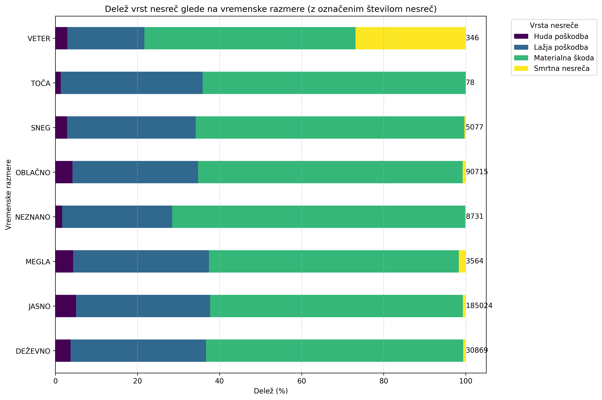

Zelo so nas presenetili rezultati glede vetra, da je bilo tako veliko resnejših poškodb, posebej smrtnih nesreč, saj jih je bilo pri ostalih slabih razmerah toliko manj. kljub temu ne smemo zanemariti informacije, da je podatkov o vetru zelo malo, tako da so lahko informacije ne zanesljive.

## Vrste udeležencev

Pogledali smo si 3 najbolj ranljive žrtve udeležencev - pešce, kolesarje in motoriste. 

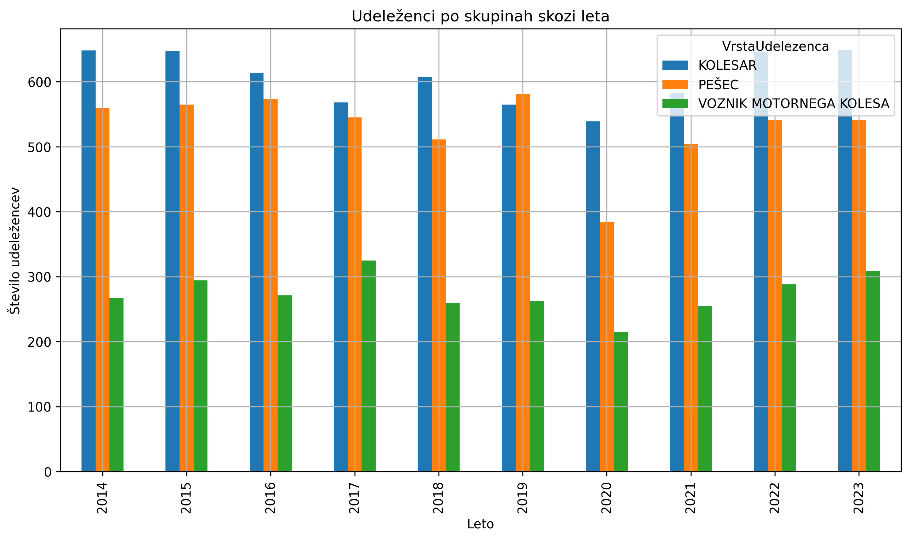

Največ žrtev je kolesarjev in pešcev, kar nas je zelo presenetilo, da je pešcev skoraj toliko kot kolesarjev. Zanimivo je tudi, da je toliko malo prometnih nesreč, kjer so žrtve motoristi.

## Primerjava nesreč po starosti

Največ nesreč povzročajo mladi vozniki, saj imajo najmanj izkušenj in vozijo preko svojih meja sposobnosti. Nato pa število nesreč z letom bolj kakor ne pada.

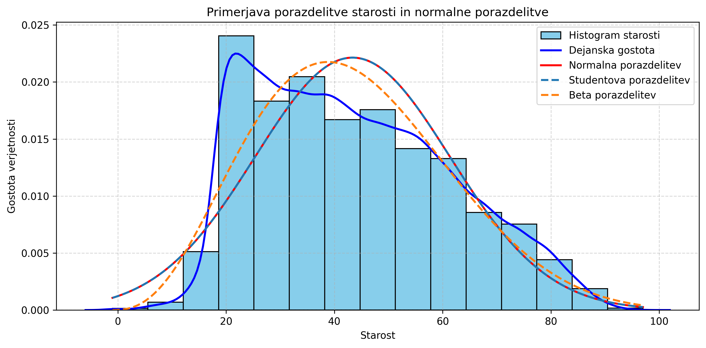

Graf se tudi ne prilega nobeni porazdelitvi. 

## Najpogostejši vzroki prometnih nesreč

Vprašali smo se tudi kateri so najpogostejši vzroki nesreč in deset najpogostejših. 

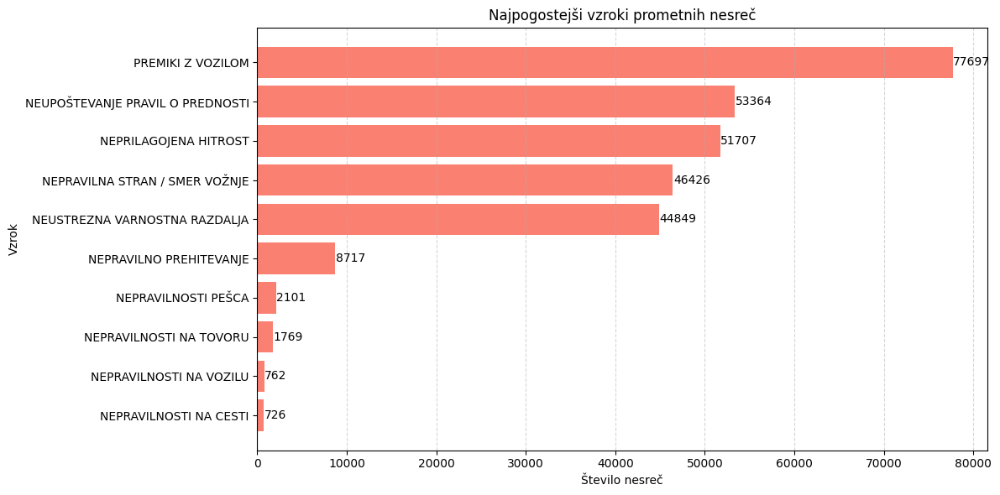

Ugotovili smo, da med najpogojših prevladujejo premiki z vozilom, kar je pričakovano, naslednje je neupoštevanje pravil o prednosti. Najbolj nas je presenetila nepravilna stran/smer vožnje, saj je bolj pogosta kot neustrezna varnostna razdalja.

## Število prometnih nesreč glede na spol

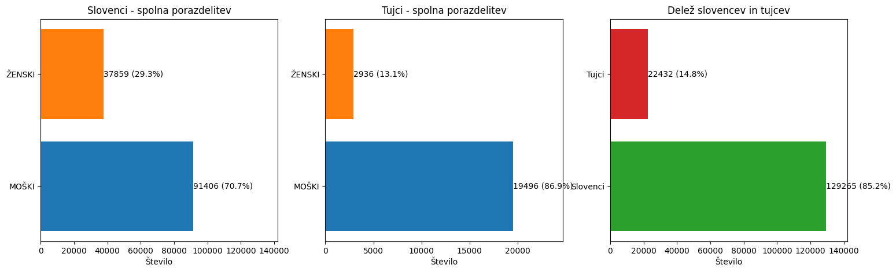

Analiza porazdelitve med slovenskimi in tujimo povzročitelji pokaže, da moški povzročijo večino nesreč v obeh skupinah. Tujci predstavljajo skoraj 15% nesreč, kar smo mnenja, da je še vedno kar veliko.

## Tuji povzročitelji prometnih nesreč v Sloveniji

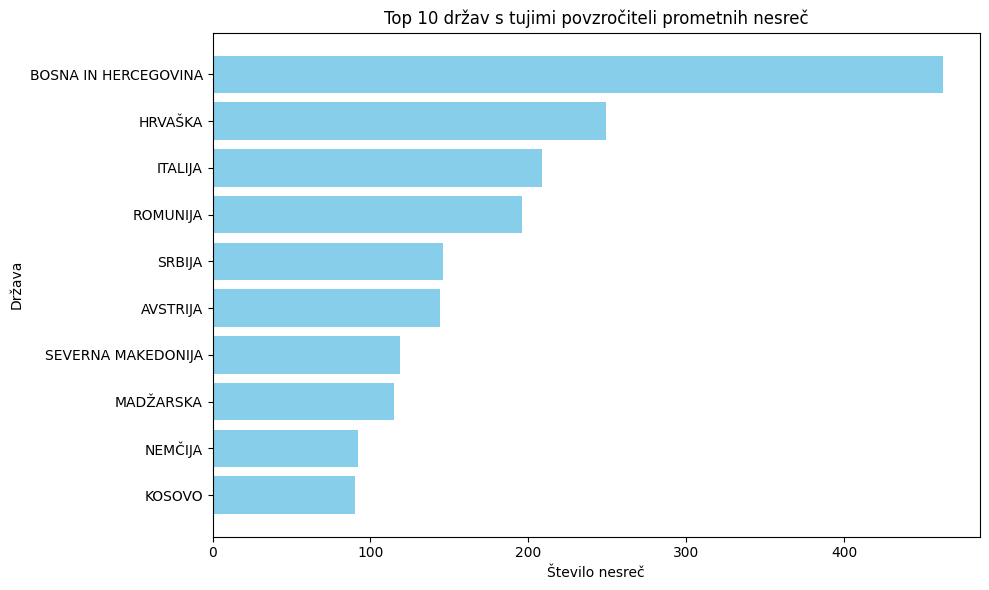

Bolj podrobno smo pogledali še tiste tuje povzročitelje in ugotovili in nam je bilo zanimivo, da ni na vrhu sosednje države, temveč Bosna in Hercegovina.

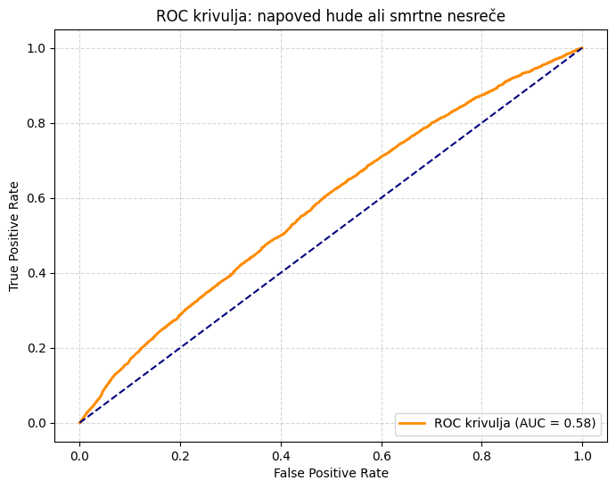

Zadnje smo se še vprašali ali lahko na podlagi določenih atributov napovemo, ali bo nesreča hujša ali ne. Uporabili smo logistično regresijo in dobili AUC = 0.58, kar pomeni, da ločevanje ni zelo zanesljivo, ampak vseeno boljše od naključnega (AUC = 0.5).

## Interaktivna aplikacija (Streamlit)

Aplikacija omogoča anlizo prometnih nesreč v Sloveniji ter napovedovanje njihove resnosti s pomočjo strojnega učenja. Vključuje naslednje funkcionalnosti:
- **Napoved resnosti nesreče:** Uporabnik vnese podatke o hipotetični nesreči, aplikacija pa s pomočjo izbranega modela napove klasifikacijo nesreče.
- **Naivni Bayes po vrsti ceste:** Predstavlja, kako se resnost prometnih nesreč razlikuje glede na vrsto ceste.
- **Zemljevid smrti po letih:** Interaktivni zemljevid s prikazom lokacij vseh smrtnih nesreč med letoma 2014 in 2023.
- **Zemljevid prometnih nesreč:** Vizualizacija nesreč glede na izbrane pogoje.
- **Alkohol in vrste nesreč:** Analiza povprečnih vrednosti alkohola po tipu nesreče.

## Zaključek

Analiza je pokazala, da imajo nekateri dejavniki, kot sta prisotnost alkohola in ura dneva, pomemben vpliv na resnost prometnih nesreč. Ugotovitve vključujejo:
- Prometne nesreče so pogostejše v nočnih urah.
- Največ nesreč se zgodi v popoldanskem času, zlasti okoli 15. ure, ko je promet najgostejši.
- Geografska porazdelitev nesreč v veliki meri sledi gostoti prebivalstva in prometno obremenjenim cestam.
- Največ nesreč povzročijo mladi vozniki.
- Napovedovanje resnosti nesreče je mogoče, vendar natančnost napovedi še ni zadostna za zanesljivo uporabo v praksi.